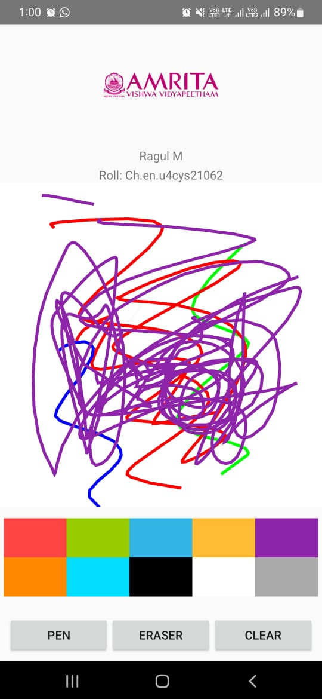

# FreeHand Drawing App  

This project is an Android application that allows users to create freehand drawings on a canvas, select different colors, and use tools like pen, eraser, and clear canvas.

## Table of Contents  
1. [Features](#features)  
2. [Screenshots](#screenshots)  
3. [Installation](#installation)  
4. [How to Use](#how-to-use)  
5. [Project Structure](#project-structure)  
6. [Code Overview](#code-overview)  
7. [Technologies Used](#technologies-used)  
8. [Contributing](#contributing)  
9. [License](#license)

## Features  
- Draw freehand on a blank canvas.
- Change pen colors with a color palette.
- Erase parts of the drawing.
- Clear the entire canvas with a button.
- Display the developer’s name, roll number, and the college logo at the top.
- Simple and interactive user interface.

## Screenshots  
<!-- Add your screenshots here -->
  

## Installation  
1. **Clone the Repository**  
   ```bash
   git clone https://github.com/yourusername/FreeHandDrawingApp.git
   cd FreeHandDrawingApp
   ```

2. **Open in Android Studio**  
   - Launch Android Studio and click **File > Open**.
   - Select the cloned repository folder.

3. **Build the Project**  
   - Click **Build > Rebuild Project** to download dependencies and sync the project.

4. **Run the App**  
   - Connect an Android device or use an emulator.
   - Click **Run > Run 'app'** to install the app on your device.

## How to Use  
1. **Drawing:** Use your finger to draw on the canvas.
2. **Change Colors:** Tap on a color from the palette at the bottom of the screen.
3. **Use Tools:**  
   - **Pen:** Switch to pen mode to draw.  
   - **Eraser:** Use the eraser to erase parts of the drawing.  
   - **Clear:** Clear the entire canvas.  
4. **View Information:**  
   - The college logo, your name, and roll number are displayed at the top of the screen.

## Project Structure  
```
FreeHandDrawingApp/
│
├── app/
│   ├── src/
│   │   ├── main/
│   │   │   ├── java/com/example/freehanddrawingapp/
│   │   │   │   ├── MainActivity.java
│   │   │   │   ├── PaintView.java
│   │   │   ├── res/
│   │   │   │   ├── layout/
│   │   │   │   │   └── activity_main.xml
│   │   │   │   ├── drawable/
│   │   │   │   │   └── your_logo.png
│   │   │   │   ├── values/
│   │   │   │   │   └── colors.xml
│   │   │   │   │   └── strings.xml
│   │   │   ├── AndroidManifest.xml
│   └── build.gradle
└── README.md
```

## Code Overview  

### 1. **MainActivity.java**
The `MainActivity` handles user interactions, such as selecting tools (pen, eraser, clear), and switches the drawing mode accordingly. It also initializes the `PaintView`.

```java
buttonPen.setOnClickListener(v -> paintView.enablePenMode());
buttonEraser.setOnClickListener(v -> paintView.enableEraserMode());
buttonClear.setOnClickListener(v -> paintView.clearCanvas());
```

### 2. **PaintView.java**
This class extends `View` to create a custom drawing canvas. It manages the drawing behavior, including changing colors and switching between pen and eraser modes.

```java
@Override
protected void onDraw(Canvas canvas) {
    super.onDraw(canvas);
    canvas.drawBitmap(bitmap, 0, 0, null);
}
```

### 3. **activity_main.xml**  
This layout file defines the structure of the app, including the logo, name, roll number, drawing canvas, and tool buttons.

```xml
<ImageView
    android:id="@+id/collegeLogo"
    android:layout_width="80dp"
    android:layout_height="80dp"
    android:layout_gravity="center"
    android:src="@drawable/your_logo"/>
```
## Technologies Used  
- **Java** for Android development  
- **XML** for designing UI layouts  
- **Android Studio** as the IDE  
- **Gradle** for build automation  

## Contributing  
If you want to contribute to this project:  
1. Fork the repository.  
2. Create a new branch: `git checkout -b feature-name`.  
3. Commit your changes: `git commit -m 'Add feature'`.  
4. Push to the branch: `git push origin feature-name`.  
5. Submit a pull request.

## License  
This project is licensed under the MIT License. You are free to modify, distribute, and use it as per the terms of the license.

---

Feel free to replace placeholders like `your_logo` with your actual file names and paths. You can also add screenshots in the "Screenshots" section and provide a live demo if desired.
